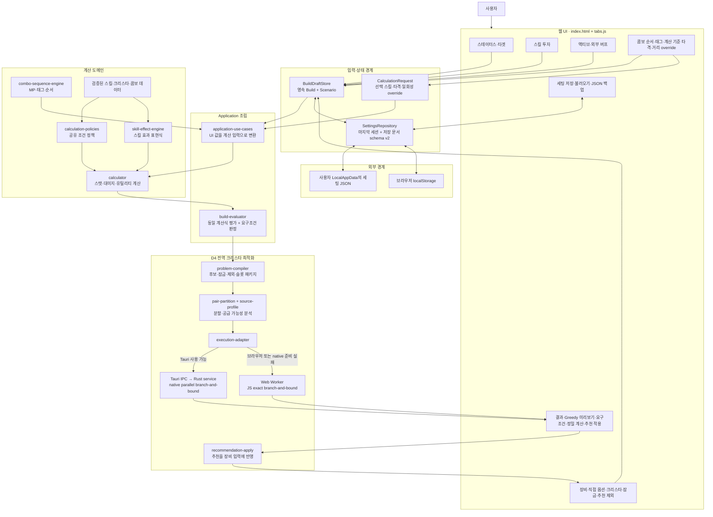
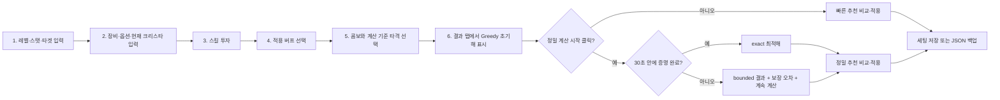

# 현재 웹 앱 기능 구조도

> 기준일: 2026-09-04  
> 기준 버전: `package.json`, `src-tauri/Cargo.toml`, `src-tauri/tauri.conf.json`이 모두 가리키는 `0.6.3`  
> 현재 상태의 판정 기준: `docs/handoff/current-development-handoff.md` + 실제 코드 + 이번에 실행한 검증

## 1. 제품 목적과 완료 기준

이 앱의 목적은 사용자가 입력한 캐릭터·장비·스킬·버프·콤보·타겟 조건을 토람 온라인의 확인된 계산 규칙에 연결하고, 8개 크리스타 슬롯을 한꺼번에 비교하여 주어진 실전 요구조건을 만족하는 최적 세팅을 찾는 것이다.

다음 네 상태는 서로 같은 의미가 아니다.

| 구분 | 의미 | 현재 해석 |
|---|---|---|
| S1 출처 연결 | 등록된 스킬에 원문 출처와 앵커가 연결됨 | 427/427 통과 |
| S2~S5 계산 검증 | 효과·공격·조건·스택 계산이 검증됨 | 기능별 검증 범위가 다르며 S1 수치만으로 완성 판정 불가 |
| D4 전역 최적화 | 8슬롯 전체 후보를 동일 계산식으로 평가하고 하한·상한·오차를 관리 | JS Worker와 Rust native 경로가 구현됨 |
| 전투 상태 시뮬레이션 | 시간, 피격, 위치, 파티, 다음 행동 같은 이벤트를 자동 재현 | 사용자가 보류한 별도 범위이며 현재 완료로 보지 않음 |

## 2. 전체 구조

## 3. 사용자 작업 흐름

결과 탭 진입은 이제 branch-and-bound를 시작하지 않고 Greedy/좌표 개선 초기해만 표시한다. 전역 상한·gap을 계산하는 Rust/Worker 정밀 검사는 결과 상단의 `정밀 계산 시작`을 눌렀을 때만 시작한다. 빠른 추천은 `최적성 미검사`로 표시하여 exact/bounded 결과와 구분한다.

## 4. 기능별 목적과 코드 소유권

| 기능 | 사용자 목적 | 주요 웹 코드 | Tauri/Rust 코드 |
|---|---|---|---|
| 스테이터스 | 레벨과 STR/INT/VIT/AGI/DEX/CRT 투자 설정 | `index.html`, `status-points.js`, `official-level-cap.js` | 없음 |
| 타겟 | 보스 레벨·방어·내성·크리티컬 저항 설정 | `index.html`, `build-draft-store.js` | 없음 |
| 장비 | 무기 유형·공격력·제련·안정률·직접 옵션 설정 | `index.html`, `crysta-ui.js`, `build-ui-controller.js` | 없음 |
| 크리스타 | 현재 장착, 조건·충돌 표시, 슬롯 잠금, 추천 제외 | `crysta-data.js`, `crysta-ui.js`, `calculation-policies.js` | 최적화 후보로 직렬화된 뒤 native 사용 |
| 스킬 | 트리별 투자, 가져오기·내보내기, 계산 효과 제공 | `skill-tree.js`, `skill-effect-engine.js`, `data/skills/*` | 계산 결과를 D4 context로 받아 사용 |
| 버프 | 습득·호환 가능한 액티브 버프와 스택, 외부 옵션 설정 | `active-buff-ui.js`, `skill-effect-engine.js` | 계산 결과를 D4 context로 받아 사용 |
| 콤보 | 습득 스킬의 순서·태그·MP·타격별 계산 기준과 근/원거리 override 설정 | `combo-ui.js`, `optimization-preferences.js`, `combo-sequence-engine.js`, `combo-rule-data.js` | 선택된 계산 기준과 최종 거리 판정이 D4 context에 포함됨 |
| 계산 | 동일 입력에 대해 최종 스탯·대미지·유틸리티 산출 | `application-use-cases.js`, `calculator.js`, `build-evaluator.js` | `d4_native_evaluator.rs`가 최적화용 요약식을 동등하게 계산 |
| D4 최적화 | 결과 진입 시 빠른 초기해, 명시적 실행 시 8슬롯 정밀 탐색 | `d4-*.js`, `optimizer.js`, `optimizer-ui-controller.js`, `optimization-preferences.js` | `d4_service.rs`, `d4_native_solver.rs`, `d4_native_evaluator.rs`, `d4_parallel_runtime.rs` |
| 결과 적용 | 추천 빌드를 현재 입력과 비교하고 잠금 슬롯을 보존하여 적용 | `d4-recommendation-apply.js`, `optimizer.js` | 없음 |
| 세팅 관리 | 마지막 세션 복원, 이름 있는 저장, 가져오기·내보내기 | `settings-repository.js`, `build-file-storage.js`, `build-state-storage.js` | `settings_repository.rs`, `settings_service.rs`, `tauri_commands.rs` |

## 5. 실행 경계

1. `app-entry.mjs`가 `legacy-script-manifest.mjs`의 순서대로 classic script를 로드한다.
2. 데이터 → 정책/엔진 → 상태 → application → 최적화 → UI 순서가 사실상 런타임 의존성 계약이다.
3. `ui-bindings.js`와 `ui-feature-registry.js`가 기능별 공개 진입점을 만들지만, 내부 구현 대부분은 아직 `window.*` 전역과 DOM 이벤트에 의존한다.
4. D4 실행 어댑터는 Tauri API가 있으면 Rust native를 우선 사용하고, 사용할 수 없거나 준비 단계에서 실패하면 Web Worker로 대체한다.
5. Tauri 실행 파일은 계산 화면을 다시 구현하지 않고 D4 서비스와 세팅 저장소를 IPC 명령으로 제공한다.

## 6. 저장되는 상태와 저장되지 않는 상태

| 상태 | 마지막 세션/저장 파일 | 비고 |
|---|---|---|
| 캐릭터·장비·직접 옵션·크리스타·잠금 | 저장 | `BuildDraft` |
| 스킬 투자·액티브 버프·외부 옵션·콤보 | 저장 | `BuildDraft` |
| 타겟 조건 | 저장 | `ScenarioContext` |
| 계산 기준 스킬·타격, 적용된 콤보 1회 효과 | 저장 안 함 | 일회성 `CalculationRequest`로 의도적으로 분리 |
| D4 진행 상태·마지막 결과 | 저장 안 함 | 런타임 상태 |
| 근거리/원거리 override | 저장 | `ScenarioContext.optimizationPreferences`; 둘 다 해제하면 스킬 기본 거리 |
| 추천 제외 크리스타 목록 | 저장 | `ScenarioContext.optimizationPreferences.bannedCrystas` |
| HP/MP/AMPR/크리티컬/ASPD 요구조건 | 저장 | 결과 탭 모달에서 조건별 활성화와 값을 설정 |

## 7. 검증 경계

- 웹 전체 회귀: `npm run verify:r9` 통과.
- 전체 회귀 묶음: `npm run test:r0` 67/67 통과. 단, native 저장 E2E는 `TORAM_E2E_CDP`가 없어 건너뜀.
- S1 출처 감사: `node tools/audit-stack-source-links.mjs --require-s1` 통과, 427/427.
- Rust: `cargo test --manifest-path src-tauri/Cargo.toml` 통과, 총 72개 테스트.
- 배포 입력 생성: `npm run desktop:prepare` 통과, 산출 버전 0.6.3.
- 실제 UI 점검: 로컬 배포본에서 6개 탭, 스킬/버프/콤보 빈 상태, 세팅 대화상자, 결과 탭 진입과 최적화 취소를 확인했다.

테스트 통과는 현재 구현의 회귀·동등성 근거다. 숨은 조작, 접근성, 사용자가 바꿀 수 없는 기본조건, 문서와 UI의 의미 차이까지 자동으로 보증하지는 않는다.
